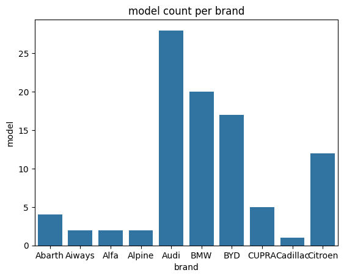
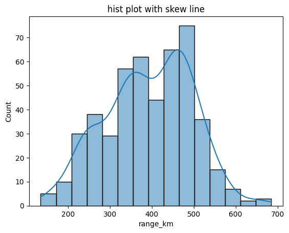
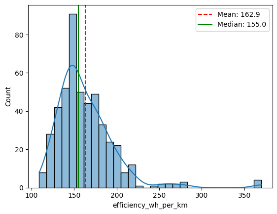
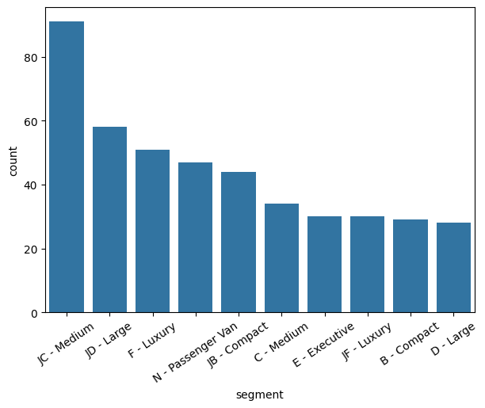
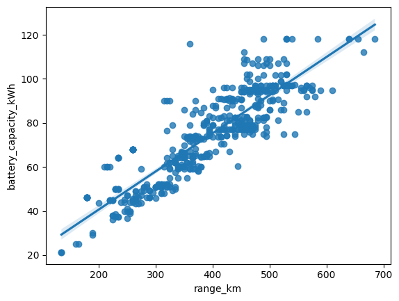
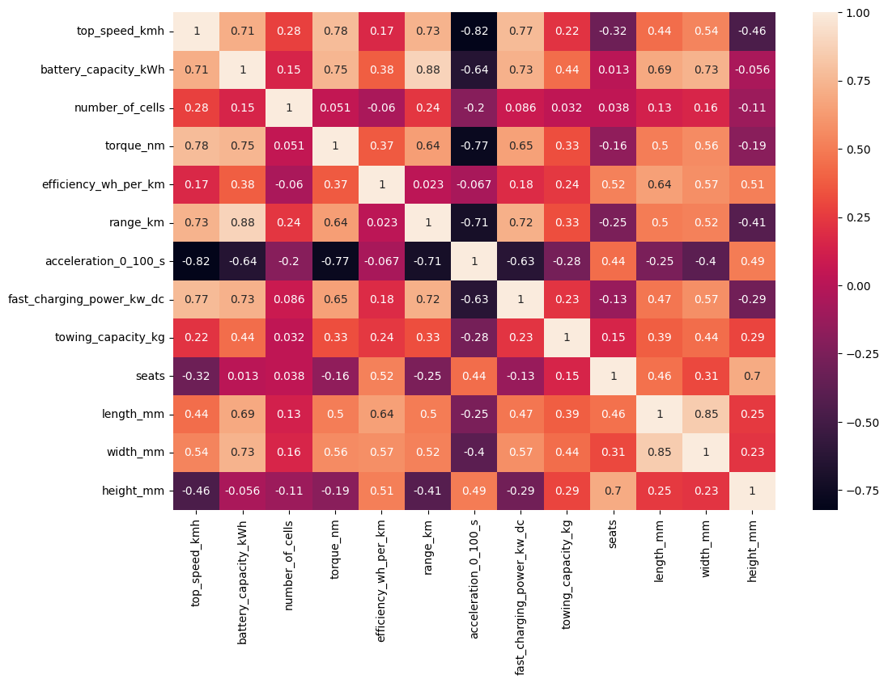

⚡ Electric Vehicles 2025 – Exploratory Data Analysis (EDA)
📋 Project Overview

This project focuses on analyzing Electric Vehicle (EV) data for 2025.
The aim is to understand trends in EV brands, performance, battery capacities, efficiency, and other key metrics that influence vehicle range and popularity.

📂 Dataset Information

Shape: (478, 22)
Columns:
['brand', 'model', 'top_speed_kmh', 'battery_capacity_kWh', 'battery_type', 'number_of_cells', 'torque_nm', 'efficiency_wh_per_km', 'range_km', 'acceleration_0_100_s', 'fast_charging_power_kw_dc', 'fast_charge_port', 'towing_capacity_kg', 'cargo_volume_l', 'seats', 'drivetrain', 'segment', 'length_mm', 'width_mm', 'height_mm', 'car_body_type', 'source_url']

🔍 Key Objectives

Perform Exploratory Data Analysis (EDA) on EV specifications.

Understand relationships between numerical variables (e.g., battery capacity vs range).

Analyze brand and model performance in terms of efficiency and range.

Visualize trends in EV body types, drivetrain, and battery technologies.

📊 Visualizations Used

Bar plots – brand vs total models, drivetrain distribution

Histograms – distribution of range and efficiency

Barplots – count across different segments

Regplots – correlation between features (e.g., battery capacity & range)

Heatmaps – correlation matrix of numerical feature

💡 Insights

Strong positive correlation between battery capacity and range (≈ 0.70).

Most EVs have ranges below 500 km.

SUV and Sedan are the most common body types.

Drivetrain distribution shows FWD and AWD dominate the market.

Conclusion

From the analysis of the 2025 Electric Vehicle dataset:

Battery capacity strongly influences range, with a positive correlation (~0.71), showing that higher-capacity batteries result in longer driving range.

Most EVs have ranges below 500 km, indicating current limitations in energy storage and efficiency.

SUVs and Sedans dominate the market, while hatchbacks are less common.

Drivetrain trends show FWD and AWD are the most popular configurations.

Variations in cargo volume, seats, and body dimensions reveal design choices that balance passenger comfort and storage.

Overall, the data provides valuable insights for EV buyers, manufacturers, and researchers to understand market trends, efficiency patterns, and design trade-offs in 2025 EVs.

This analysis lays the foundation for further studies, including predictive modeling for EV range, optimization of battery performance, and market segmentation analysis.